

#ΙΟΝΙΟ ΠΑΝΕΠΙΣΤΗΜΙΟ
 
#ΠΜΣ ΤΜΗΜΑΤΟΣ ΠΛΗΡΟΦΟΡΙΚΗΣ
 
#ΜΑΘΗΜΑ: Σχεδίαση της Διάδρασης Ανθρώπου-Υπολογιστή 
 
##Επιβλέπων καθηγητής: Χωριανόπουλος Κωνσταντίνος 

##Φοιτητής: Χριστοδούλου Μαρία - ΠΜ2015001 - p15chri@ionio.gr  

Κέρκυρα, 2017 

##Σύνοψη:

Είναι γεγονός  ότι ζούμε σε μια τεχνολογικά αναπτυγμένη εποχή όπου η συγκέντρωση  των μαθητών διασπάται πολύ ποιο εύκολα από τα υπερσύγχρονα παιχνίδια και τα social media που υπάρχουν στο διαδίκτυο. Αυτό έχει σαν αποτέλεσμα ένα μεγάλο ποσοστό των μαθητών να μην ασχολείται με τις εργασίες για το σπίτι. Έτσι αποφάσισα μέσα από τη διδασκαλία των μαθηματικών να πειραματιστώ με σκοπό να κεντρίσω το ενδιαφέρον των μαθητών με ένα ποίο σύγχρονο και ευχάριστο τρόπο. Βάση των παραπάνω, μέσο του λογισμικού Scratch, δημιούργησα ένα εκπαιδευτικό βίντεο-παιχνίδι (Mathematical-Man): https://scratch.mit.edu/projects/133259416/#player ,για αποτελεσματικότερη εκμάθηση των τεσσάρων βασικών πράξεων (πρόσθεση, αφαίρεση, πολλαπλασιασμός, διαίρεση) .  Το παιχνίδι αυτό απευθύνεται στη πρωτοβάθμια εκπαίδευση συγκεκριμένα στη Γ’ δημοτικού. Μπορεί να χρησιμοποιηθεί κατά τη διάρκεια της διδασκαλίας κάνοντας το μάθημα ποιο ενδιαφέρον για τους μαθητές αλλά και στο σπίτι για περαιτέρω εξάσκηση. Δεν χρειάζεται ο μαθητής να διαθέτει ιδιαίτερες γνώσεις χρήσης Η/Υ για την εκτέλεση του.

##Εισαγωγή 

##Περιγραφή gameplay του παιχνιδιού: 

Το παρόν βίντεο παιχνίδι αποτελείται από τρία στάδια (Level 1,2,3). Σε κάθε στάδιο ο χρήστης καλείται να κυνηγήσει το σωστό φάντασμα με τη σωστή απάντηση. Η μαθηματικές πράξεις εμφανίζονται υπό την εξής μορφή: (5+2=7, 3x6=25, 12/2=6, 60-20=40). Υπάρχουν τρία φαντάσματα από τα οποία για κάθε μαθηματική πράξη τα δύο έχουν λάθος απάντηση.  Εάν φάει το σωστό φάντασμα τότε εμφανίζεται το μήνυμα “Correct Answer” και προχωρά στην επόμενη πράξη. Διαφορετικά εάν φάει  το λάθος φάντασμα τότε εμφανίζεται το μήνυμα “Wrong Answer” και συνεχίζει μέχρι να φάει το σωστό. Ο χρήστης έχει μέχρι τρείς  ζωές για κάθε στάδιο και κάθε στάδιο συμπεριλαμβάνει τέσσερις  συνολικά μαθηματικές πράξεις. Για να μπορεί να κινηθεί στην πίστα χρειάζεται να χρησιμοποιεί τα τέσσερα  πλήκτρα βέλους (arrow keys). Τέλος το παιχνίδι ολοκληρώνεται όταν περάσει με επιτυχία και τα τρία στάδια.

##Αφήγηση:  

Η αφήγηση είναι απαραίτητη για να καταλάβει ο μαθητής ότι παίζοντας το συγκεκριμένο βίντεο παιχνίδι θα επωφεληθεί. Στην έναρξη του παιχνιδιού γίνεται ένας μικρός διάλογος μεταξύ ενός μαθητή και του ήρωα έτσι ώστε να ωθήσει τον χρήστη να βελτιωθεί στην προπαίδεια με ένα ποιο ευχάριστο τρόπο.  

##Διαχείριση λάθους: 

Μετά από αρκετούς πειραματισμούς, κατέληξα στο συμπέρασμα ότι το βίντεο παιχνίδι είναι πολύ ποιο αποδοτικό όταν εμφανίζονται διάφορες απαντήσεις και ο μαθητής πρέπει να κυνηγήσει την σωστή απάντηση.  Κάθε φορά που τρώει το λάθος φάντασμα εμφανίζεται το μήνυμα “Wrong Answer” και το φάντασμα εξαφανίζετε. Αφού εξαφανιστεί το λάθος φάντασμα συνεχίζεται το κυνήγι φαντασμάτων για την εύρεση της σωστής απάντησης. Δεν σταματά η διάδραση για να γίνει επίδειξη της σωστής απάντησης, συνεχίζεται μέχρι να φάει το σωστό φάντασμα.  Στόχος είναι μέσα από το λάθος ο μαθητής να κατανοεί το σφάλμα του και να συνεχίζει για την σωστή απάντηση.  

##Σενάριο χρήσης: 

Ένας μαθητής Γ’ τάξης του Δημοτικού, θεωρεί τις εργασίες για το σπίτι βαρετές με επακόλουθο να μην ασχολείται. Τον τελευταίο καιρό ο δάσκαλος του έχει παρατηρήσει ότι παρουσιάζει κάποια κενά στις βασικές πράξεις μαθηματικών, έτσι αποφάσισε να του ελκύσει το ενδιαφέρον με ένα ποίο ευχάριστο τρόπο, μέσα από το  βίντεο παιχνίδι Mathematical-Man. Το  συγκεκριμένο βίντεο παιχνίδι βασίζεται στο κλασικό βίντεο παιχνίδι Pac-Man το οποίο είναι ένα από τα ποιο δημοφιλέστερα βίντεο παιχνίδια που υπάρχουν μέχρι σήμερα. Εντάξαμε στο κλασικό Pac-Man τις βασικές μαθηματικές πράξεις ούτως ώστε ο μαθητής να πετύχει το στόχο του σε ένα διαφορετικό περιβάλλον, στην γνώστη σε όλους αρένα του Pac-Man. Σκοπός του βίντεο παιχνιδιού είναι να απορροφήσει την συγκέντρωση και το ενδιαφέρον του μαθητή.       

##Επιλογή εργαλείων: 

Τα εργαλεία που χρησιμοποίησα ήταν τα εξής: 
 
MIT Scratch: Το λογισμικό Scratch αποτελεί το κύριο εργαλείο ανάπτυξης του βίντεο-παιχνιδιού.  Το Scratch είναι ένα περιβάλλον προγραμματισμού στο οποίο οι χρήστες δημιουργούν προγράμματα με βάση τη θεατρική σκηνή. Διαθέτει γραφική γλώσσα προγραμματισμού με την οποία κάνει πιο προσιτό τον προγραμματισμό στα παιδιά (από 8 ετών και άνω).

##Διαδικασία ανάπτυξης:

Η κεντρική ιδέα για το βίντεο παιχνίδι προήρθε από τις διαλέξεις  του μαθήματος “Σχεδίαση της Διάδρασης Ανθρώπου-Υπολογιστή” και μέσο των οδηγιών που μας δόθηκαν από το GitHub. Η επιλογή του βίντεο παιχνιδιού έγινε βάση του κριτήριου ότι είναι κλασικό και γνωστό προς όλους. Επίσης για την τελική απόφαση του βίντεο παιχνιδιού επηρεάστηκα από τις παρακάτω ιδέες:  http://www.mathplayground.com/mathman_addition.html και https://scratch.mit.edu/projects/105862604/. Μέσα από την καθοδήγηση και τις παρατηρήσεις των εκπαιδευτών γίνονταν σταδιακές αλλαγές για το καλύτερο επιθυμητό αποτέλεσμα. Επιπρόσθετα κατά την διαδικασία ανάπτυξης αντιμετωπιστήκαν διάφορα προβλήματα μέχρι να επιτευχθεί η συνεχόμενη διάδραση τα οποία επιλύθηκαν στην πορεία δημιουργίας. 

##Ενδεικτικές Οθόνες:  

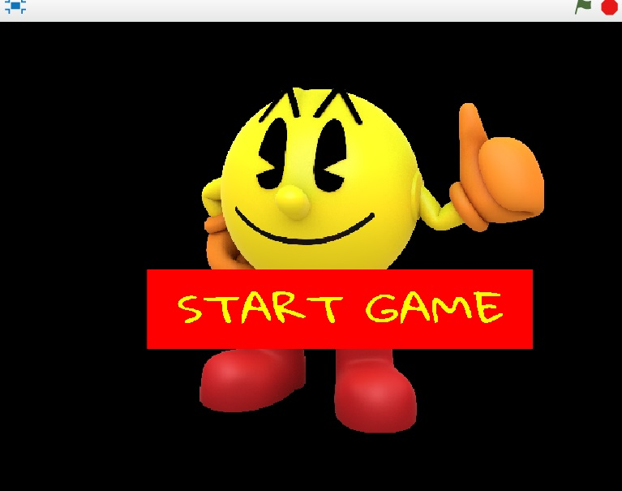

Έναρξη παιχνιδιού πρέπει να γίνει click πάνω στο εικονίδιο start game. 

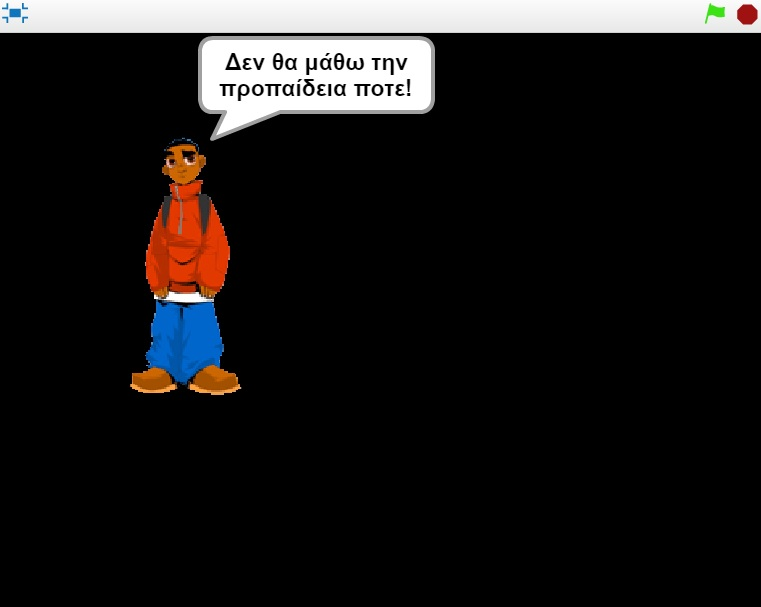

Αρχική αφήγηση που παρουσιάζει την ιστορία (1/5). 

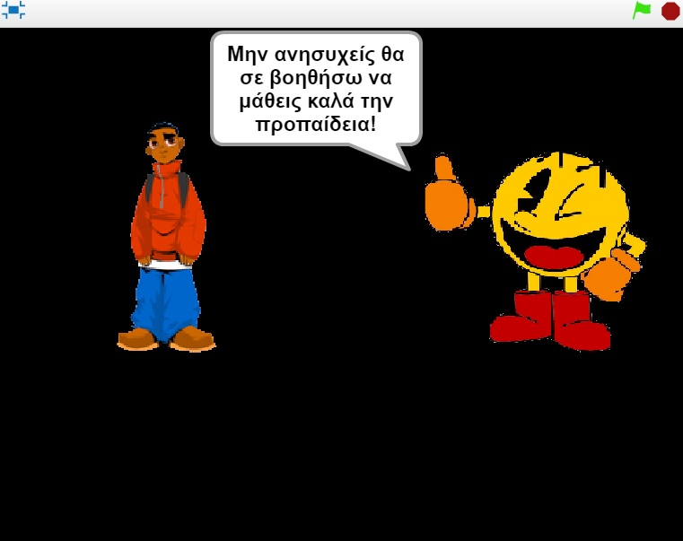

Αρχική αφήγηση που παρουσιάζει την ιστορία (2/5).

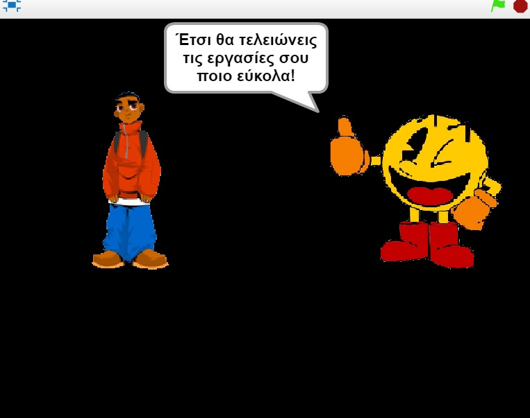

Αρχική αφήγηση που παρουσιάζει την ιστορία (3/5).

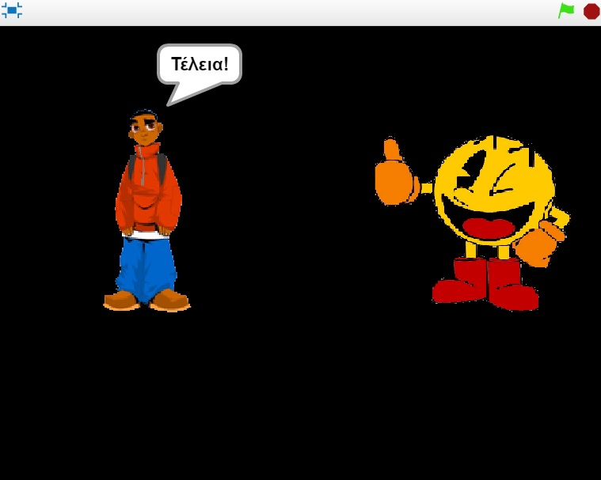

Αρχική αφήγηση που παρουσιάζει την ιστορία (4/5).

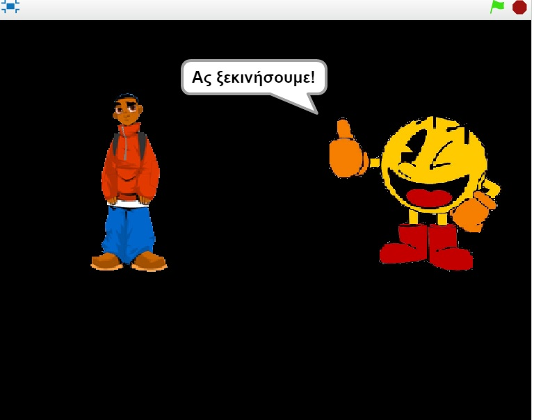

Αρχική αφήγηση που παρουσιάζει την ιστορία (5/5).

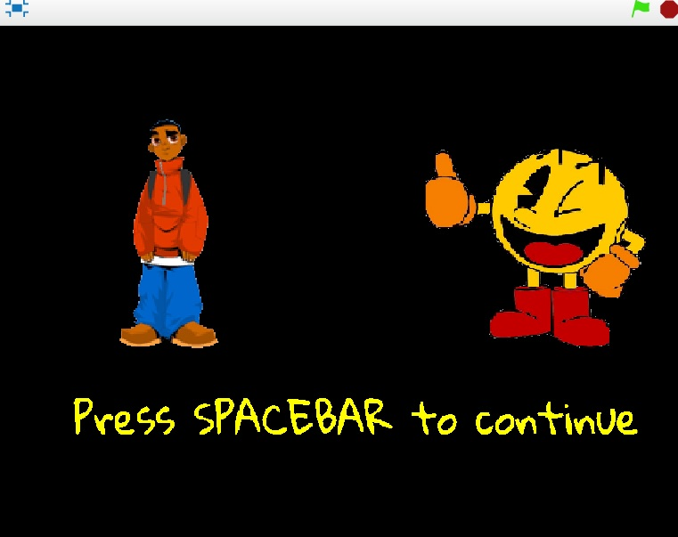

Έναρξη του Level 1 πρέπέι να πιέσει το πλήκτρο spacebar. 

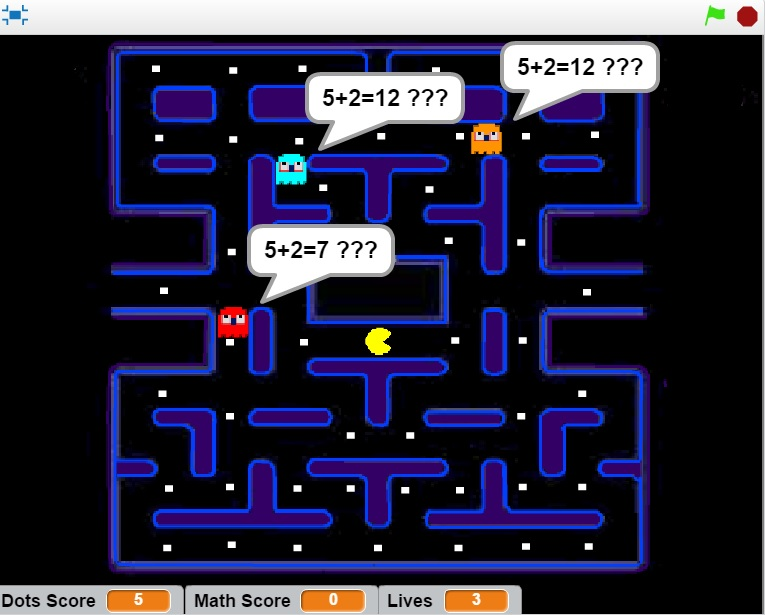

Οθόνη gameplay με την πράξη της πρόσθεσης.

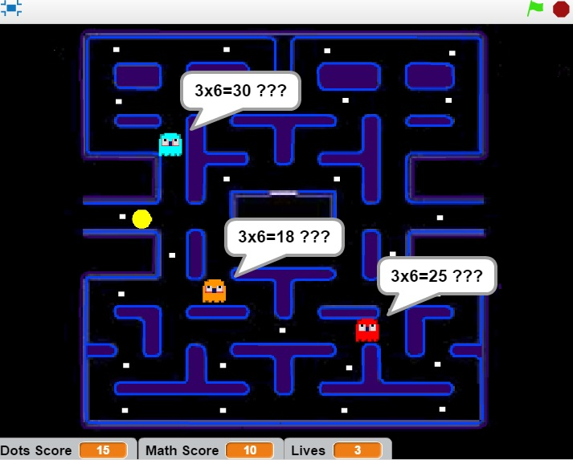

Οθόνη gameplay με την πράξη του πολλαπλασιασμού. 

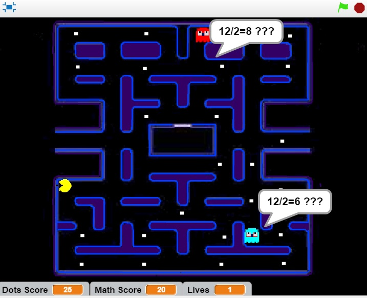

Οθόνη gameplay με την πράξη της διαίρεσης. 

Οθόνη gameplay με την πράξη της αφαίρεσης.

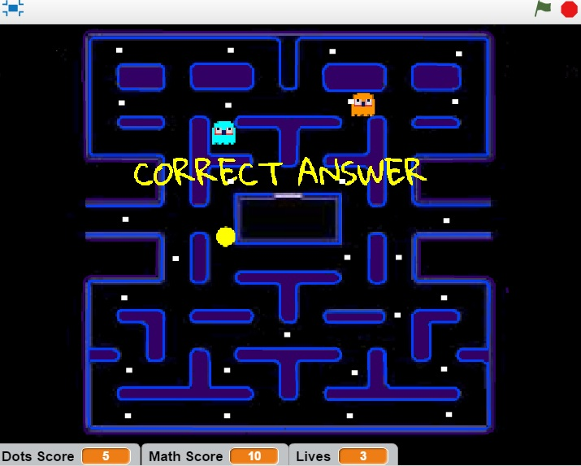

Οθόνη σε περίπτωση σωστού αποτελέσματος. 

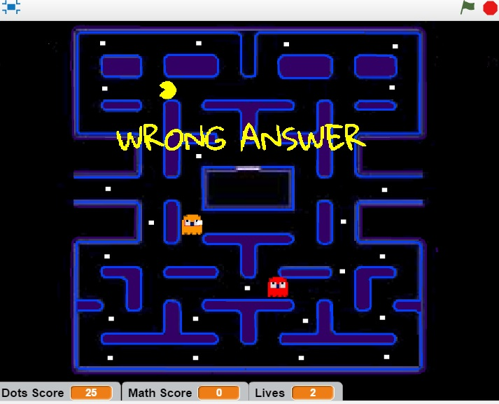

Οθόνη σε περίπτωση λανθασμένου αποτελέσματος.

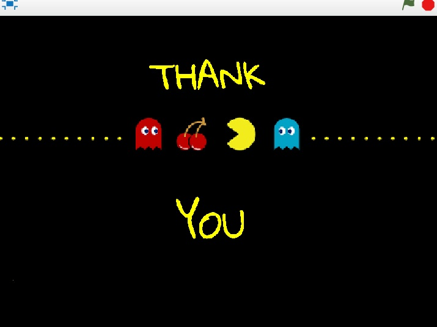

Οθόνη σε περίπτωση ολοκλήρωσης του παιχνιδιού. 

##LINK:

https://scratch.mit.edu/projects/133259416/#player

