#ΙΟΝΙΟ ΠΑΝΕΠΙΣΤΗΜΙΟ 
#ΠΜΣ ΤΜΗΜΑΤΟΣ ΠΛΗΡΟΦΟΡΙΚΗΣ 
#ΜΑΘΗΜΑ: Επικοινωνία Ανθρώπου-Υπολογιστή 
 
Επιβλέπων καθηγητής: Χωριανόπουλος Κωνσταντίνος 

Φοιτήτρια:

Χριστοδούλου Χρύσω, p15chri2@ionio.gr

Α.Μ. Π2015005 

#Σύνοψη:

Η διδασκαλία των μαθηματικών, για τους εκπαιδευτικούς αποτελούσε από πάντα αντικείμενο πειραματισμού με σκοπό την μετάδοση γνώσεων με πιο δημιουργικό και διεισδυτικό τρόπο. Στηριγμένη στην συγκεκριμένη άποψη δημιούργησα με τη βοήθεια του λογισμικού Scratch, ένα εκπαιδευτικό βιντεοπαιχνίδι με στόχο την εξοικείωση των μαθητών στην πρόσθεση μονοψήφιων και διψήφιων αριθμών.
Link για το παιχνίδι: https://scratch.mit.edu/projects/128329339/

#Εισαγωγή:

##Περιγραφή gameplay του παιχνιδιού:

Ο Πέρυ έχει σκοπό να αφανίσει όλα τα φαντάσματα που στοίχειωσαν ξαφνικά το σπίτι του με το υπερόπλο του. Όταν ο Πέρυ πυροβολεί το φάντασμα εμφανίζεται μια πράξη και απαντώντας σωστά, επιδρά η δύναμη του όπλου του με αποτέλεσμα να το πιάσουμε. Η δυσκολία του παιχνιδιού αυξάνεται βαθμιαία, ξεκινώντας από πράξεις πρόσθεσης με μονοψήφιους αριθμούς και στην συνέχεια με διψήφιους. Χρησιμοποιώντας τα πλήκτρα δεξιά-αριστερά και τα πάνω-κάτω ο Πέρυ και το υπερόπλο κινούνται αντίστοιχα. Επίσης χρησιμοποιώντας το πλήκτρο space πυροβολούμε τα φαντάσματα. Κάθε φορά που πυροβολούμε ένα φάντασμα, εμφανίζεται μια συγκεκριμένη πράξη. Αν απαντήσουμε σωστά το φάντασμα αφανίζεται ενώ αν απαντήσουμε λάθος εμφανίζεται η σωστή απάντηση και έπειτα το φάντασμα μας δίνει μια άλλη πράξη. Αν απαντήσουμε λάθος πάλι, εμφανίζεται η απάντηση και δεν καταφέρνουμε να πιάσουμε το φάντασμα. Θα πρέπει να το πυροβολήσουμε ξανά για να καταφέρουμε να το πιάσουμε απαντώντας σωστά στην ίδια πράξη. Αυτό έχει ως σκοπό την αποστήθιση των σωστών απαντήσεων. Για κάθε σωστή απάντηση προστίθεται ένας πόντος στο συνολικό σκορ του παιχνιδιού που φαίνεται στα αριστερά της οθόνης.  Όλες οι πίστες του παιχνιδιού έχουν διαφορετικό περιβάλλον, αφού το παιχνίδι διαδραματίζεται σε χώρους του σπιτιού. Συνολικά υπάρχουν 5 πίστες εκ των οποίων οι 4 έχουν 3 φαντάσματα ενώ στην 5η πίστα υπάρχει ένα γιγαντοφάντασμα. Στην τελευταία πίστα, το γιγαντοφάντασμα ρωτά συνολικά 13 δύσκολες ερωτήσεις με διψήφιους αριθμούς, με την διαφορά ότι δεν παρέχεται η δυνατότητα να απαντήσεις σωστά στην ίδια πράξη. Αν απαντήσουμε λάθος, μειώνεται το σκορ που συγκεντρώσαμε μέχρι στιγμής, ενώ αυξάνεται στο φάντασμα και αντίθετα. Το παιχνίδι ξεκινάει με αναπαράσταση του συμβάντος, όπου ο Πέρυ, ο γάτος που είναι ο ήρωας του παιχνιδιού, ενώ κοιμάται βαθιά τον ξυπνάει ένας περίεργος ήχος και βλέπει ότι το σπίτι του έχει στοιχειωθεί από φαντάσματα. Στην συνέχεια βρίσκει το όπλο του και αρχίζει να κυνηγάει τα φαντάσματα σε κάθε δωμάτιο του σπιτιού. Τα φαντάσματα όμως είναι έξυπνα και για να καταφέρουμε να τα πιάσουμε πρέπει να απαντήσουμε σωστά στις μαθηματικές πράξεις που μας δίνουν. Το παιχνίδι ολοκληρώνεται όταν απαντήσουμε σωστά σε περισσότερες από 6 μαθηματικές πράξεις που μας δίνει το γιγαντοφάντασμα. 

##Αφήγηση:
Κατά την έναρξη του παιχνιδιού η αφήγηση παίζει σημαντικό ρόλο στην «ψυχολογία» του χρήστη αφού του δίνεται ένα κίνητρο, με την χρήση ενός ήρωα ως καθοδηγητή, για να καταβάλει προσπάθεια να νικήσει. Ο πρωταγωνιστής του παιχνιδιού είναι γάτος ούτως ώστε ο χρήστης να ευαισθητοποιηθεί με την παρουσία του ή και να τον ταυτίσει με το κατοικίδιό του.  Έπειτα το ότι τα φαντάσματα διαταράσσουν την ηρεμία του Πέρυ, που κοιμόταν τόσο ήσυχα, και για να καταφέρει να ξανακοιμηθεί θα πρέπει να τα αφανίσει ξεπερνώντας τις πιθανές του αδυναμίες στα μαθηματικά, μέσα από των υπολογισμό 3 πράξεων σε κάθε πίστα, ενώ στην τελική πίστα, τον υπολογισμό 13.

##Διαχείριση λάθους:
Οι λανθασμένες επιλογές του χρήστη, πρέπει να διαχειριστούν με τέτοιο τρόπο, ούτως ώστε να επιτευχθεί όσο γίνεται το μέγιστο όφελος κατά την διάδραση. Όταν οι χρήστες κάνουν λάθη, καλό θα ήταν όχι μόνο να γίνεται η επανάληψη της προσπάθειας αλλά να εμφανίζεται και το σωστό αποτέλεσμα. Αναλυτικότερα στα 4 στάδια, όταν ο χρήστης κάνει λάθος την πρώτη πράξη που δίνει το φάντασμα, εμφανίζεται η απάντηση αλλά μετά δίνεται μια άλλη πράξη, ευκολότερη ή της ίδιας δυσκολίας με την πρώτη. Αν κάνει ξανά λάθος εμφανίζεται η σωστή απάντηση, όμως δεν καταφέρνει να πιάσει τελικά το φάντασμα. Για να καταφέρει να το πιάσει θα πρέπει να επαναληφθεί η ίδια διαδικασία. Δηλαδή, να χρησιμοποιήσει ξανά το υπερόπλο του και να απαντήσει στην πράξη που δίνει το φάντασμα. Στην τελική πίστα η διαφορά είναι πως, σε περίπτωση λάθους εμφανίζεται το σωστό αποτέλεσμα αλλά δεν υπάρχει η δυνατότητα επανάληψης της ίδιας ερώτησης. Έτσι αυξάνεται το σκορ του γιγαντοφαντάσματος, μειώνεται το σκορ του χρήστη και πυροβολώντας το ξανά η πράξη αλλάζει.   Αυτό έχει ως απώτερο σκοπό να κάνει τον χρήστη να καταβάλει το μέγιστο της προσπάθειάς του για να καταφέρει να νικήσει. Συμπληρωματικά θα πρέπει να απαντήσει σωστά σε περισσότερες από 6 μαθηματικές πράξεις.

#Προδιαγραφές Ghostbusters (Cat edition)

##Σενάριο χρήσης:
Η Περσεφόνη είναι μαθήτρια της Δ’ τάξης του δημοτικού. Αν και είναι επιμελής στης υποχρεώσεις της, βαριέται πολύ τις εργασίες των μαθηματικών. Ο δάσκαλός της προσπαθεί να βρει έναν ευχάριστο τρόπο να την ωθήσει να ασχοληθεί με τα μαθηματικά με στόχο να την κάνει να τα αγαπήσει και να δει πως είναι πιο εύκολα απ’ ότι φαντάζεται, αφού το μόνο που της λείπει είναι εξάσκηση. Σκοπεύει να την βοηθήσει να εξασκηθεί στις πράξεις της πρόσθεσης με μονοψήφιους και διψήφιους αριθμούς, με το βιντεοπαιχνίδι «Ghostbusters (Cat edition)». Στο συγκεκριμένο παιχνίδι η μαθήτρια μπορεί να πετύχει τους επιθυμητούς στόχους σε ένα ευχάριστο περιβάλλον που τραβάει την προσοχή και έτσι δεν χάνεται το ενδιαφέρον..

##Επιλογή εργαλείων:
Τα εργαλεία που χρησιμοποίησα είναι τα εξής:
**MIT Scratch**: Αποτελεί το κύριο εργαλείο ανάπτυξης του βιντεο-παιχνιδιού. Το Scratch είναι ένα περιβάλλον προγραμματισμού στο οποίο οι χρήστες δημιουργούν προγράμματα με το σύρσιμο δομικών στοιχείων με ενέργειες που ανήκουν σε ένα αντικείμενο. Δίνει την δυνατότητα αλλαγής του γραφικού περιβάλλοντος και της ένταξης ήχου, προσφέροντας μεγαλύτερο ενδιαφέρον. Είναι σχετικά εύκολο στην εκμάθηση και την χρήση, καθώς είναι κατάλληλο για παιδιά και εφήβους.

**PIXLR**: Είναι ένα λογισμικό για επεξεργασία φωτογραφιών. Υπάρχει online και σε application. Χρησιμοποίησα αυτό το λογισμικό για να επεξεργαστώ εικόνες και γραφικά τα οποία εισήγαγα αργότερα στο Scratch ως sprites backdrops.

** AUDACITY**: Είναι ένα λογισμικό επεξεργασίας ήχου. Χρησιμοποιήθηκε για επεξεργασία μερικών ήχων τα οποία μετά ανέβασα στο Scratch ούτως ώστε να γίνει πιο ελκυστική η διάδραση.
Επίσης θα ήθελα να σημειώσω ότι τα περισσότερα ηχητικά εφέ είναι από το λογισμικό Scratch, ενώ κάποια άλλα είναι κατεβασμένα από την ιστοσελίδα http://www.youtube-mp3.org/ μέσω YouTube και επεξεργασμένα από το Audacity.

##Διαδικασία ανάπτυξης:
Η αρχική ιδέα για την δημιουργία του παιχνιδιού Ghostbusters, προήλθε από τα παιχνίδια Ghostbusters Game και Ghostbusters-the movie game (https://scratch.mit.edu/projects/119594399/ και https://scratch.mit.edu/projects/1593724/  αντίστοιχα). Αυτά τα δύο χρησιμοποιήθηκαν για να τελειοποιήσω την ιδέα του παιχνιδιού μου. Επίσης συμβουλεύτηκα αυτό το βίντεο https://www.youtube.com/watch?v=lKLczpwSnag ούτως ώστε να αντιληφθώ πώς γίνονται οι βασικές λειτουργίες του Scratch. Ακόμη δανείστηκα στοιχεία από το παιχνίδι https://scratch.mit.edu/projects/11931783/, ειδικότερα τις κινήσεις του όπλου. 

##Δοκιμαστική εφαρμογή του Ghostbusters (Cat edition)
Επίσης έγινε μια δοκιμαστική εφαρμογή σε 5 μαθητές Δ’ τάξης (ο ένας εκ των οποίων είναι συγγενής μου), οι οποίοι το βρήκαν πολύ ενδιαφέρον αν και ποτέ δεν είχαν δει καμία ταινία Ghostbusters για να καταλάβουν ακριβώς τι πρέπει να κάνουν, δηλαδή πώς σκοτώνονται τα φαντάσματα και πώς λειτουργεί το όπλο, έτσι το άφησα στην φαντασία τους. Το παιχνίδι είναι σε μια πιο απλούστερη μορφή για να μην είναι περίπλοκο ούτως ώστε να μην χάνεται το ενδιαφέρον. Τα πιο αδύνατα παιδιά στις μαθηματικές πράξεις δεν απελπίζονταν, αφού τους δινόταν ξανά η ευκαιρία να απαντήσουν σωστά στις πράξεις. Έπειτα στην τελική πίστα, κάποια παιδιά δυσανασχέτησαν που ήταν λίγο δύσκολες οι πράξεις, αλλά αυτοί που έχαναν πείσμωναν και το έπαιζαν ξανά και ξανά μέχρι να νικήσουν. Ακόμη το ότι τους δίνεται άφθονος χρόνος για να σκεφτούν ή να γράψουν κάτω την πράξη και να απαντήσουν σωστά είναι ένα προτέρημα που δεν τους ώθησε στο να βαρεθούν το παιχνίδι με ευκολία. Οι αλλαγές των πιστών και τα λίγα φαντάσματα, είχαν θετικά αποτελέσματα στην διάδρασή τους αφού δεν μπερδεύονταν.

#Ενδεικτικές Οθόνες
##Αρχική οθόνη για έναρξη του παιχνιδιού.

##Αρχική αφήγηση που παρουσιάζεται η ιστορία 

##Πρώτο στάδιο όπου ο Πέρυ ζητά την βοήθειά μας

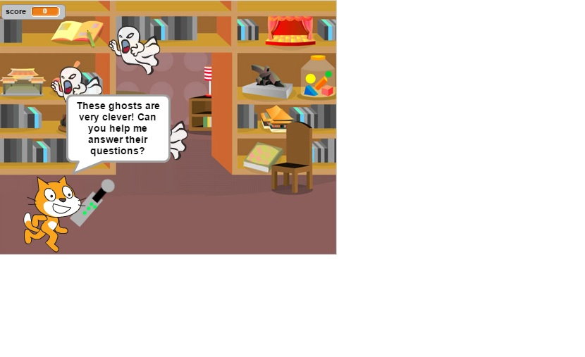

##Όταν πυροβολήσουμε το φάντασμα εμφανίζεται μια πράξη 

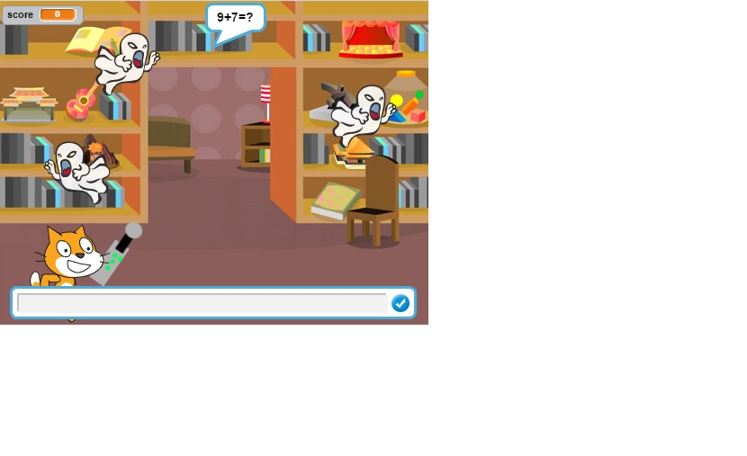

##Όταν απαντήσουμε σωστά σε μια πράξη το φάντασμα σιγά-σιγά εξαφανίζεται 

##Όταν απαντήσουμε λάθος εμφανίζεται η σωστή απάντηση

##Έπειτα εμφανίζεται μια άλλη πράξη

##Ακόμη μια περίπτωση όπου απαντάμε σωστά

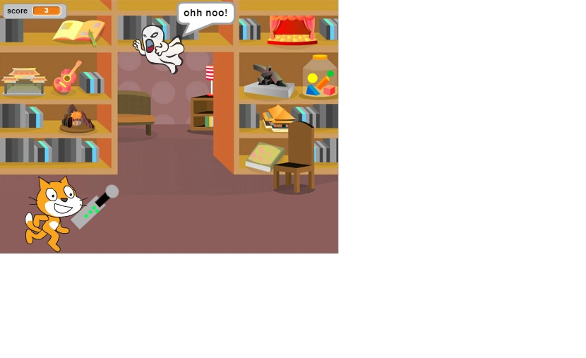

##Δεύτερη πίστα 

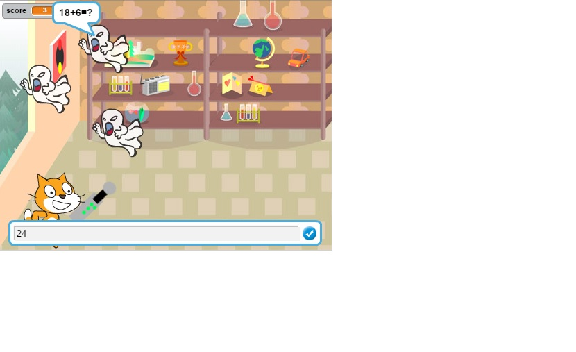

##Τρίτη πίστα

##Τέταρτη πίστα

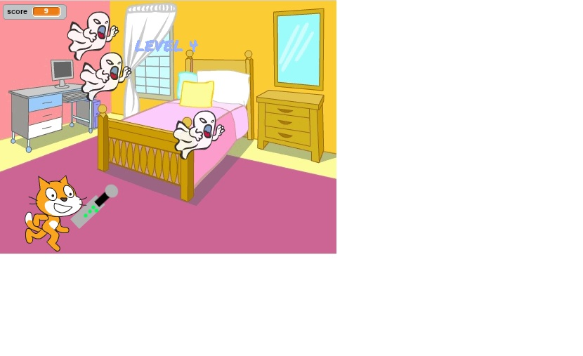

##Τελική πίστα

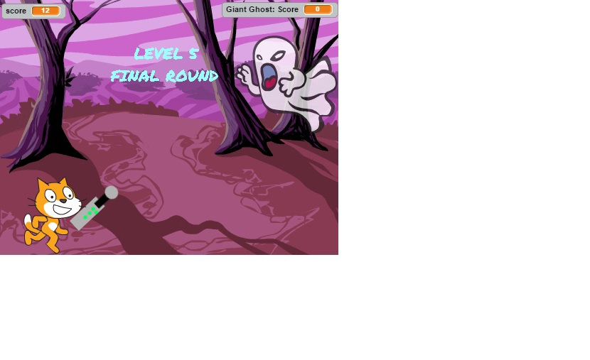

##Η πρώτη πράξη που μας δίνει το γιγαντοφάντασμα

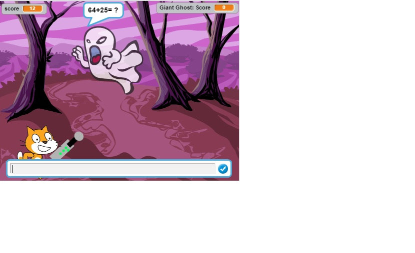

##Σε περίπτωση λάθους

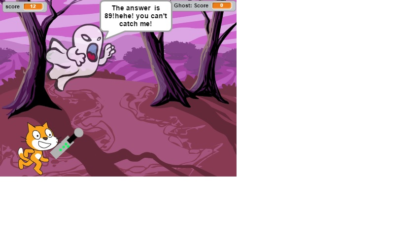

##Στην συνέχεια όταν πυροβολήσουμε ξανά το φάντασμα εμφανίζεται μια άλλη πράξη

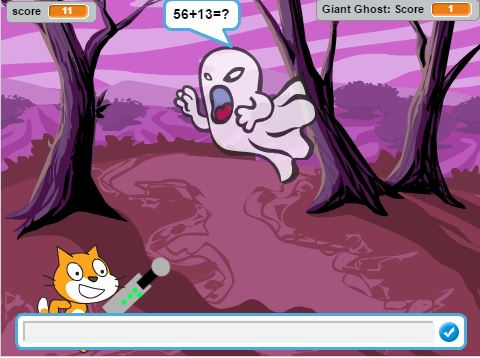

##Όταν απαντήσουμε σωστά

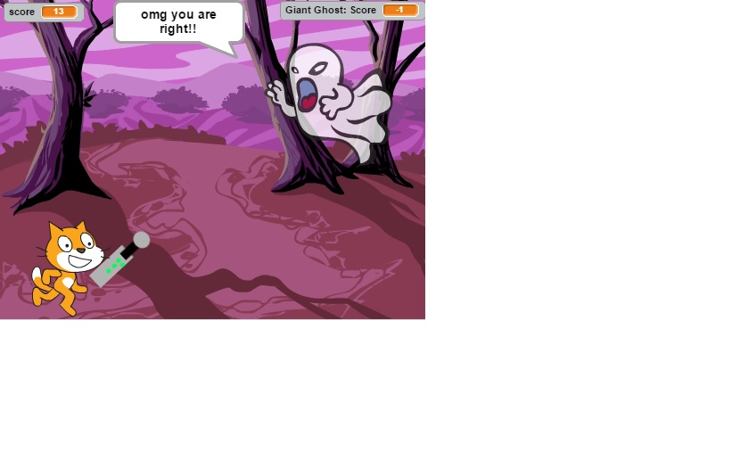

##Σε περίπτωση που χάσουμε

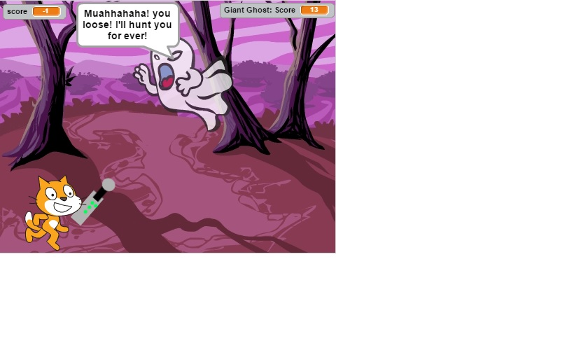

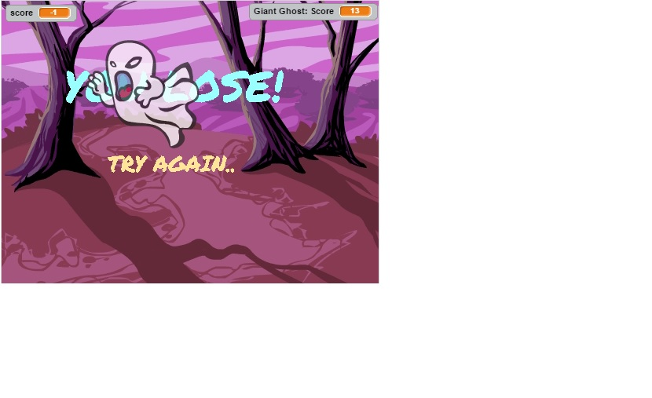

##Σε περίπτωση που νικήσουμε

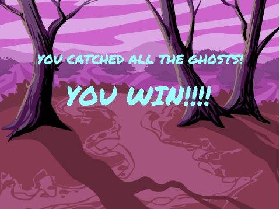

#Συμπεράσματα:
Το Ghostbusters (Cat edition) είναι ένα βιντεοπαιχνίδι το οποίο είναι εφαρμοσμένο με το πρόγραμμα σπουδών της Δ’ τάξης του δημοτικού και πληροί τις προϋποθέσεις ως ένα υλικό για την ταχύτερη κατανόηση και ενθάρρυνση του μαθητή να ασχοληθεί με το μάθημα των μαθηματικών.

#Βελτιώσεις :
Αρχικά, η γάτα έδινε την ερώτηση, αλλά μετά θεώρησα πως ήταν καλύτερο να δίνουν τα φαντάσματα την πράξη με συντομία (π.χ. 4+7=? και όχι “find the value of 4+7”). Έπειτα αντί να εμφανίζεται η σωστή απάντηση από πάνω, πίστεψα πως θα ήταν καλύτερο να την εμφανίζουν τα φαντάσματα ούτως ώστε να μπορούν να την δουν οι χρήστες με ευκολία και για να θεωρήσουν αντίπαλούς τους τα φαντάσματα. Δηλαδή ότι τα φαντάσματα κατέχουν τις μαθηματικές πράξεις και ξέρουν όλες τις απαντήσεις ενώ οι χρήστες κάνουν λάθη. Αυτό έχει ως αποτέλεσμα να τους ωθήσει να πεισμώσουν περισσότερο και να καταβάλουν προσπάθειες για να νικήσουν το παιχνίδι. 

