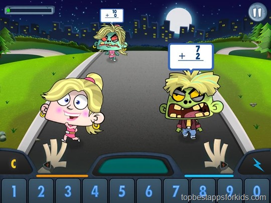
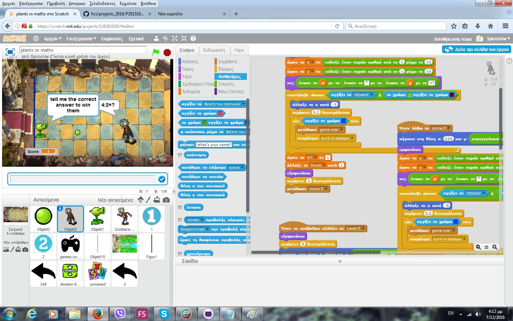
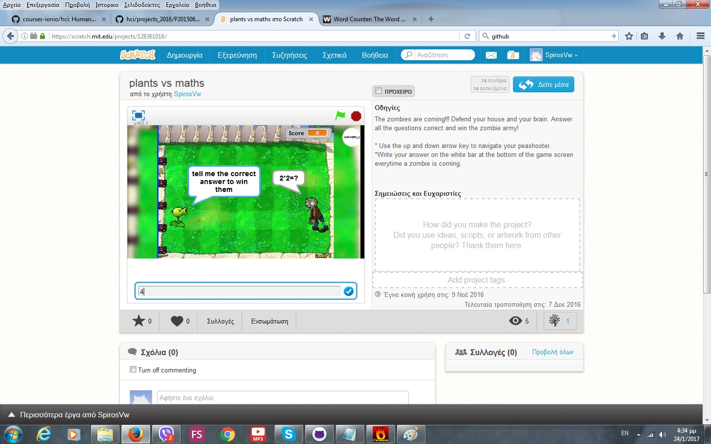
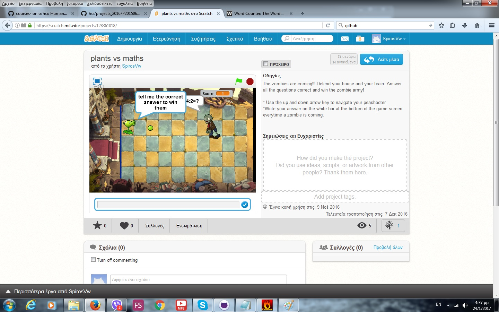
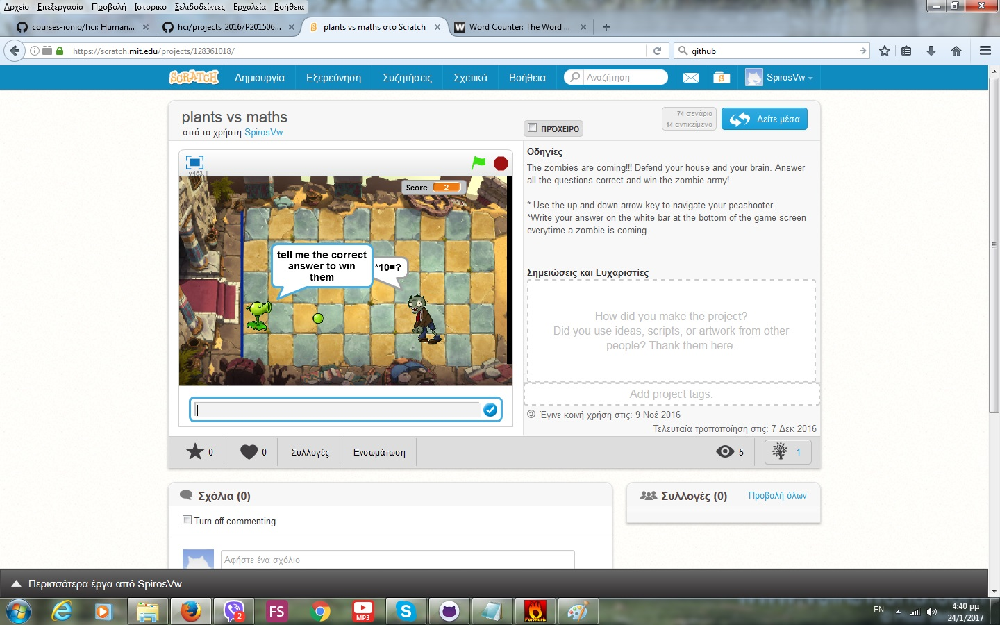

##Eργασίες 2016

*Τίτλος εργασίας: Εκπαιδευτικά βιντεο-παιχνίδια (serious videogames)

##Όνομα: Σπύρος Βέργης 

ΑΜ:Π2015103

##1ο παραδοτέο: 

Εκπαιδευτικό βιντεο-παιχνίδι με το Scratch

##2ο παραδοτέο

## Προδιαγραφές

*Ηλικία: Μαθητές γ' δημοτικού

*Γνώσεις: Βασικές γνώσεις υπολογιστή,πολλαπλασιασμός και διαίρεση

*Θεματική ενότητα:Πολλαπλασιασμός-Διαίρεση(Ενότητα 8 κεφ.46-47 γ' δημοτικού)

## Εργαλεία και ιδέες

*Χρήση εργαλέιου Scratch

*Στοιχεία(ιδέες και κώδικας) απο τα βιντεοπαιχνίδια Plants vs Zombies και Maths vs Zombies

Link:https://scratch.mit.edu/projects/1954637/

Plants vs Zombies-Original from Scratch

Maths vs Zombies

##Βιντεοπαιχνίδι

*Το βιντεο παιχνίδι έχει όνομα Plants vs Maths

*Στόχος του παιχνιδιού είναι να αποτρέψεις τα zombies απο το να φτάσουν σε εσένα

*Για να το κάνεις αυτό έχεις ένα μικρό φυτό στην αρχή του κήπου σου

*Το φυτό αυτό έχει την δυνατότητα να εκτοξεύει μικρα βλήμματα (φασόλια) για να πολεμαει τους εχθρούς

#Το παιχνίδι δουλεύει ως εξής:

*Κάθε zombie που εμφανίζεται στην οθόνη λέει και μια συγκεκριμένη πράξη(πολλαπλασιασμός ή διαίρεση) μεταξύ 2 αριθμών

*Για να χτυπήσεις τα zombies με το φυτό σου πρέπει να δώσεις την σωστή απάντηση στον πολλαπλασιασμό ή στην διαίρεση που σκέφτεται ο εχθρός

*Χρησιμοποίησε το μυαλό σου πριν το χρησιμοποιήσουν τα zombies!

My prototype

Some gameplay

Link: https://scratch.mit.edu/projects/128361018/#player

##Μελλοντικές προσθήκες

*Περισσότερα από ένα επίπεδα (level 1-πολλαπλασιασμός,level 2-διαίρεση,level 3-και τα 2)

*Κουμπί controls που θα εξηγεί πως λειτουργεί το παιχνίδι.

*Tutorial για τον πολλαπλασιασμό και την διαίρεση.

##3ο παραδοτέο

*Στο τρίτο παραδορέο έγιναν μερικές βελτιώσεις πανώ στο βιντεοπαιχνίδι.

*Στο παιχνίδι προστέθηκε ένα νέο κουμπί controls το οποίο εξηγεί πως λειτουργεί το παιχνίδι. Κάτω από τις οδηγείες παιχνιδιού προστέθηκαν άλλα δύο κουμπία προκειμένου να υπάρχει βοηθητικό υλικό για τα παιδιά, πάνω στον πολλασιασμό και στην διαίρεση.  

#Main Menu

#Instructions

#Multiplication

#Division

*Επιπρόσθετα προστέθηκε και Level 2 το οποίο προϋποθέτει γνώσεις τέλειας διαίρεσης με διαιρέτη το 2 και το 3. Στο level 2  οι αντίπαλοι ζητούν το αποτέλεσμα τέτοιων διαιρέσεων, πέρα από τον πολλαπλασιασμό, ο οποίος υπήρχε από το level 1.

*Ο χρήστης πρέπει να πολεμίσει τους αντιπάλους του για περίπου 3 λεπτά. Στο τέλος του εμφανίζεται ένα εικονίδιο που του λέει οτι νίκησε και επιπλέον διαθέτει και το σκορ του χρήστη. Εάν ο χρήστης κάνει λάθος σε μία πράξη ή δεν βρίσκεται στο σωστό τετράγωνο μπορεί πολύ απλα να ξαναπροσπαθήσει.

#Level 1

#Level 2

 
##4ο παραδοτέο-Τελική Αναφορά

##Ονοματεπώνυμο: Σπύρος Βέργης

##ΑΜ:Π2015103

##Εκπαιδευτικό βιντεο-παιχνίδι με το Scratch

*Tίτλος παιχνιδιού:plants vs maths

*Link παιχνιδιού:https://scratch.mit.edu/projects/128361018/

*Σύνοψη: Το παιχνίδι "Plants vs Maths" είναι ένα βιντεοπαιχνίδι βασισμένο στο κλασσικό βιντεοπαιχνίδι "Plants vs zombies". Στόχος του παιχνιδιού είναι να επιβιώσει ο παίκτης και να σταματήσει την επίθεση του στρατού των zombies. Με την χρήση ενός μικρού φυτού που εκτοξεύει βλήματα πολεμάς τους εχθρούς. Το παιχνίδι αυτό έχει ως σκοπό την εξάσκηση του πολλαπλασιασμού και της διαίρεσης μαθητών γ΄δημοτικού.

*Εισαγωγή: Το παιχνίδι ξεκινάει με το αρχικό μενού. Εκεί ο παίκτης μπορει να επιλέξει ένα από τα 2 επίπεδα (επίπεδο 1-πολλαπλασίασμός & επίπεδο 2-πολλαπλασιασμός και διαίρεση) ή να πάει στις οδηγείες παιχνιδιού. Στις οδηγείες περιλαμβάνεται ένα μικρό κειμενάκι που αναφέρει περιληπτικά πως παίζεται το παιχνίδι και διαθέτει επίσης 2 ακόμα κουμπιά που οδηγούν σε παραδείγματα πολλαπλασιασμών και διαιρέσεων σε περιπτωση που θέλει ο παίκτης να κάνει μία ανακεφαλαίωση. 
Το καθένα από τα επίπεδα διαρκεί 3 λεπτα και 20 δευτερόλεπτα. Σε αυτό το χρόνο ο παίκτης πρέπει να πολεμήσει τα zombies και να μην τα αφήσει να περάσουν στο σπίτι του. Για να το κάνει αυτό πρέπει να χρησιμοποιήσει τις γνώσεις του στα μαθηματικά. Κάθε εχθρός που έρχεται σκέφτεται μία μαθηματική πράξη. Εάν ο παίκτης απαντήσει σωστά στην πράξη αυτή τότε το φυτό που έχει στον κήπο του πυροβολάει το zombie. Το φυτό πρέπει να είναι στην ίδια ευθεία με το zombie διότι μπορεί να πυροβολήσει μονο ευθεία μπροστά του. 
Εάν ένα από τα zombie φτάσει στον σπίτι του παίκτη το παιχνίδει τερματίζει και του εμφανίζεται η εικόνα της ήττας. Όσο τo zombie βρίσκεται μακριά από το σπίτι του, μπορει να προσπαθεί ξανά και ξανά ώσπου να βρεί την λύση. Όταν περάσει ο χρόνος του παιχνιδιού χωρίς κανένα zombie να έχει φτάσει στο σπίτι του παίκτη εμφανίζεται η εικόνα επιτυχίας. Στο παιχνίδι υπάρχει και το σκορ με βάσει το οποίο ο παίκτης μπορεί να κρίνει την επίδοσή του(πόσες σωστές απαντήσεις πρόλαβε να δώσει σε αυτά τα λεπτά).

*Επιλογή εργαλείων: Το εργαλείο πάνω στο οποίο βασίστηκα για την ανάπτυξη του παιχνιδιού είναι το scratch.

*Διαδικασία ανάπτυξης: Με βάση τον κώδικα του παιχνιδιού "Plants Vs Zombies" (link:https://scratch.mit.edu/projects/1954637/) δημιουργημένο από τον χρήστη taddl, υλοποίησα τον κώδικα του παιχνιδιού "plants vs maths". Χρησιμοποίησα τον βασικό κώδικα κάνοντας τις κατάληλλες μετατροπές. Η διαφορά ανάμεσα στο κλασσικό βιντεο παιχνίδι είναι ότι στο plants vs maths χρησιμοποιώ μόνο το βασικό φυτό για να πολεμίσω τα zombies(peashooter) και κατήργησα τον μηχανισμό αγοράς φυτών μέσω του ήλιου. Ο λόγος που έκανα κάτι τέτοιο είναι η απλούστευση του παιχνιδιού προκειμένου να είναι ευκολονόητο και χρήσιμο για τα παιδία της γ΄ δημοτικού παραμένοντας εξίσου διασκεδαστικό.
Δημιούργησα έτσι το παιχνίδι ώστε το κύριο χαρακτηριστικό του να είναι η χρήση μαθηματικών. Επιπλέον πρόσθεσα και μία μεταβλιτή score με βάσει την οποία ο παίκτης μπορει να δει την επίδοσή του στο παιχνίδι αυτό και αντίστοιχα στον πολλαπλασιασμό και στην διαίρεση.  Ύστερα πρόσθεσα τις δύο ενδεικτικές εικόνες που βρίσκονται στις πληροφορίες για τον πολλαπλασιασμό και την διαίρεση ώστε να βοηθήσω τους παίχτες που παρουσιάζουν μία μικρη δυσκολία στην λύση τέτοιων μαθηματικών ερωτημάτων. 

*Οι αλλαγές αναλυτικά:
1)Αφαίρεσα τον μηχανισμό αγοράς των φυτών μέσω του ήλιου.
2)Κράτησα το βασικό φυτό του παιχνιδιού(peashooter) σαν σύμμαχο του παίχτη.
3)Το κάθε zombie έχει μαζί του ένα μαθηματικό πρόβλημα(πολλαπλασιασμός-διαίρεση) και ο μόνος τρόπος το φυτό να του επιτεθεί είναι δίνοντας την σωστή απάντηση στο πρόβλημα αυτό.
4)Δημιούργησα μία μεταβλητή score ώστε ο παίχτης να γνωρίζει τις επιδόσεις του. 

#Ενδεικτικές Οθόνες

#Main Menu

#Instructions

#Multiplication

#Division

#Level 1

#Level 2-Division 

#Level 2-Multiply

#Good Ending

#Bad Ending

*Συμπεράσματα: Η εμπειρία μου αυτό το εξάμηνο πανώ σε αυτή την εργασία μου δίδαξε πολλά πράγματα. Αυτό που παρατήτησα κυρίως είναι πως παρόλη την ελευθερία που μας δώθηκε στην επιλογή θέματος ενός εκπαιδευτικού παιχνιδιού ,ακομα και με το απλό και εύχρηστο πρόγραμμα scratch που είχαμε στην διάθεση μας , δυσκολευόμαστε να υλοποιήσουμε ένα εκπαιδευτικό βιντεοπαιχνίδι. Μπορεί σαν ιδέα να φαινόταν κάτι απλό, στην πραγματικότητα όμως χρειάστηκε πολλή προσπάθεια και κόπο για να παράξουμε κάτι που να συνδυάζει μάθηση και ψυχαγωγία, χωρίς το ένα να υπερτερεί του άλλου. Και δεν ήταν πάντα ικανοποιητικό το αποτέλεσμα που πέρναμε. Σαν εμπειρία όμως εμένα προσωπικά μου προσέφερε πολλά καθώς μπόρεσα να δω έστω επιφανιακά,από πρώτο χέρι μάλιστα, όλα τα στάδια της μελέτης και της υλοποίησης ενός εκπαιδευτικού βιντεοπαιχνιδιού.

*Πηγαίος Κώδικας από:https://scratch.mit.edu/projects/1954637/