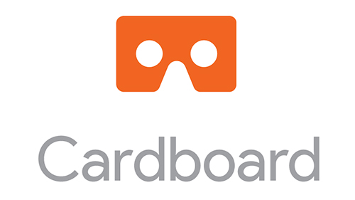
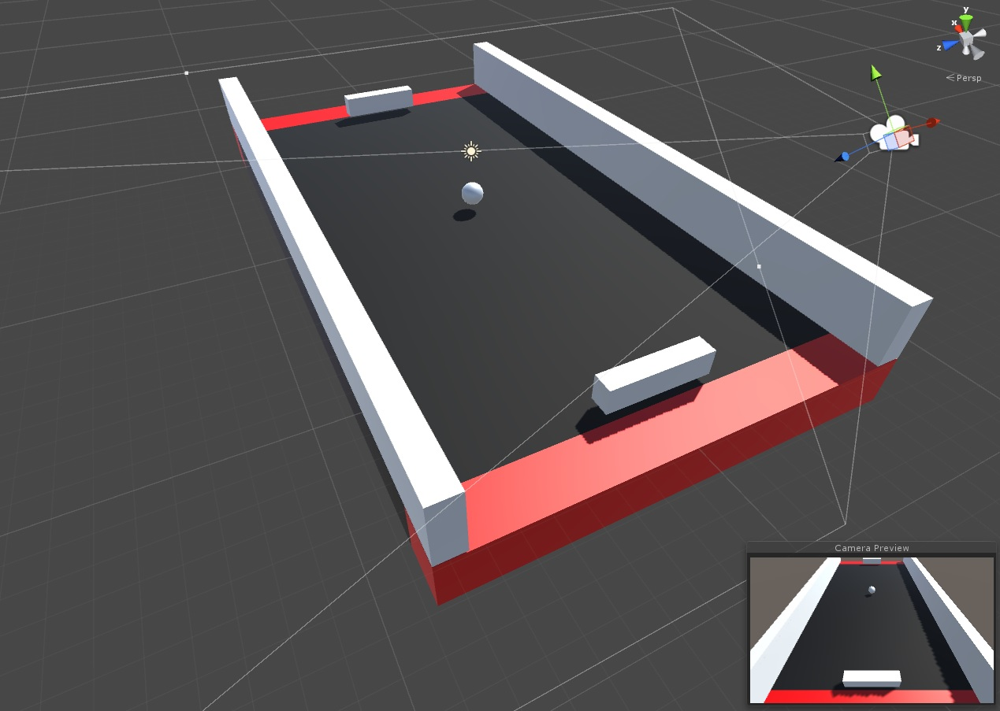
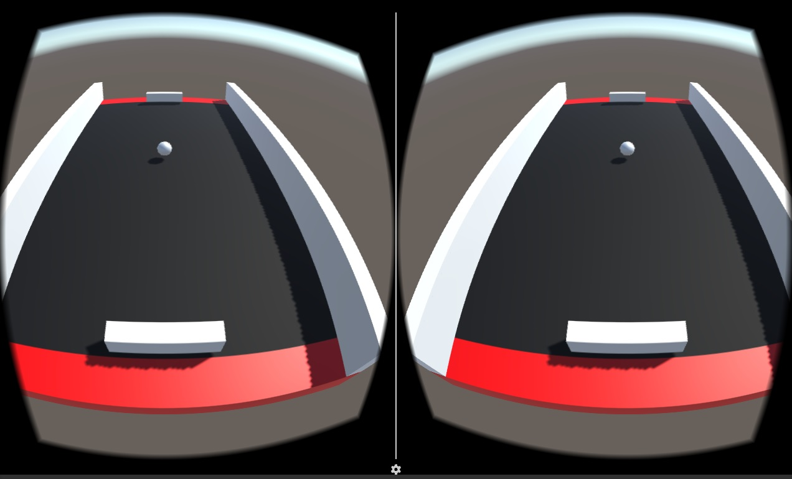

#ΙΟΝΙΟ ΠΑΝΕΠΙΣΤΗΜΙΟ 
#ΤΜΗΜΑ ΠΛΗΡΟΦΟΡΙΚΗΣ
#ΜΑΘΗΜΑ: Επικοινωνία Ανθρώπου-Υπολογιστή
**Διδάσκων καθηγητής:** Χωριανόπουλος Κωνσταντίνος

**Φοιτητής:**

ΓΙΟΡΝΤΑΝΩΒ ΝΤΑΝΙΕΛ - Π2015105 - p15gior@ionio.gr

#Παρουσίαση πρωτοτύπου της εφαρμογής - Παραδοτέο 2
##Προδιαγραφές

* **Χαρακτήρας:** Η παρόν εφαρμογή είναι μια ανακατασκευή του γνωστού arcade παιχνιδιού του 1972, "Pong", σε 3D περιβάλλον. Το παιχνίδι σκοπεύεται να είναι για Android, με την επιλογή ο χρήστης/παίχτης να μπορεί να παίζει και σε Virtual Reality.
* **Πλαίσιο χρήσης:** Είναι ψυχαγωγικό παιχνιδι, απευθήνεται σε οποιονδήποτε κάτοχο smartphone με Android, ανεξαρτήτως ηλικίας ή φύλου. Η χρήση ενος VR headgear είναι προαιρετική.
* **Διεργασία χρήσης:** Το παιχνίδι θα ξεκινάει με το μενού, στο οποίο ο παίχτης θα διαλέξει με την οθόνη αφής αν θέλει να παίξει σε VR mode ή 3D mode. Μόλις ξεκινήσει το παιχνίδι, ο παίχτης θα ελέγχει την ρακέτα του μόνο με το γυροσκόπιο του κινητού. Θα κουνάει δηλαδή το κινητό, αν παίζει σε 3D, ή το κεφάλι του, αν παίζει σε VR.

##Εγκατάσταση εργαλείων ανάπτυξης και προτότυπο παιχνίδι

* Εργαλεία που χρησιμοποιήθηκαν μέχρι στιγμής:
  * Unity game development platform + Google VR SDK (Software Development Kit) for Unity.
  * Microsoft Visual Studio 2015 IDE για τα scripts σε C#.

https://unity3d.com/

https://developers.google.com/vr/unity/

https://www.visualstudio.com/vs/

1[7](7.jpg)

* Προτότυπο arcade παιχνίδι Pong:

http://www.ponggame.org/

##Στιγμιότυπα πρωτοτύπου

#Στιγμιότυπο 1

Αρχικά στάδια του παιχνιδιού στο περιβάλλον του λογισμικού Unity.

#Στιγμιότυπο 2

Μεταγενέστερο στάδιο και όψη της κάμερας του παίχτη.

#Στιγμιότυπο 3

Η κάμερα του παίχτη σε VR mode.

#Η εργασία σε εξέλιξη (3D demo)

Δεν υπάρχει διεργασία στο παρόν demo, έχει όμως σκοπό να δείξει την κατάσταση της εργασίας και την κίνηση της μπάλας.

https://danielyor.github.io/PongVR-webtest/

#Παραπάνω πληροφορίες για την πλατφόρμα Unity, πως δούλεψα και τι έχω χρησιμοποιήσει εως τώρα

* Το Unity δουλεύει με αντικείμενα (GameObjects), στα οποία ο developer προσδίδει εμφάνιση (materials), μορφή (transform, dimensions, orientation) και συμπεριφορά (scripts/κώδικας σε C#).
* Τα αντικείμενα στο παραπάνω demo έχουν φτιαχτεί από εμένα, το Unity παρέχει μερικά default GameObjects που μπορείς να φτιάξεις (όπως ο κύβος και η σφαίρα τα οποία βλέπετε στο demo).
* Η κίνηση και αντίδραση/αναπήδηση της μπάλας οφήλεται σε script, το οποίο έχω πάρει και τροποποιήσει, από το παρακάτω guide: https://noobtuts.com/unity/2d-pong-game 
* Για την δημιουργία 3D και VR modes, θα φτιαχτούν 2 διαφορετικά Camera αντικείμενα: Μία κλασσική και μία VR, η οποία παρέχεται από το Google SDK.

Ευχαριστώ.
